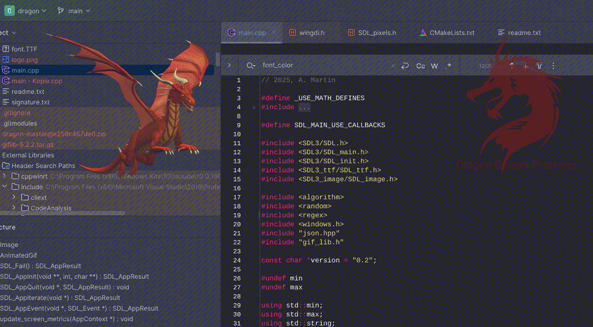

Screen Dragon (inspired by "ScreenDragons", 2020 Brian Shepherd)
===========================================================================



About
-----
Tool that inserts watermarks into screen presentations to make them visually disruptive.

When the application is running, an overlay is placed over the entire screen. The layer consists of diagonal lines, 
(animated) logos, and message texts used as signatures.

The logo and signature can be resized, rotated, and positioned via drag & drop.

The application has two states:  

1. Layout mode  
   Captures mouse gestures and lets you change the size and position of logos and signatures, as well as their 
   transparency using the mouse wheel.  
   (A green frame at the edges of the screen indicates you're in layout mode.)

2. Shielding mode  
   Passes mouse gestures to the underlying applications.  
   (Keyboard shortcuts remain functional if the application has focus.)

You can toggle between the modes using the `space bar` or the `return key`.

When starting for the first time, if no settings file exists, a signature and a logo object are created as examples.
When exiting the application, a settings file is saved in the program directory.  

The settings file contains all configuration values in JSON format and can also be edited manually.  

Placeable objects can be freely added to the "objects" list in the settings file. 
Supported logo image formats are SVG, PNG, BMP, JPG, Webp, TIF, and GIF. 
To show the first frame for GIFs only, change the object's "type" in the settings file from "AnimatedGif" to "Image".  
The `image_full_path` refers to the fully resolved location of the image, or relative to the current path from 
where the program was started. Missing parameters are filled with standard values, if possible.


Key mappings
------------
```
Keyboard shortcuts (application must have focus):
---------------------------------------------------------------------------
Space / Return                    - Toggle between layout and 
                                    shielding mode
0..5                              - Adjust diagonal line width (0 = off)
R G B S K W (layout mode)         - Change color of diagonal lines or
                                    signatures
D                                 - Toggle between dashed and solid lines
H                                 - Toggle visibility of overlay ("dragon")
F (layout mode)                   - Flip images horizontally
X                                 - Quit application (and save settings)
Arrow Left / Right                - Adjust global transparency
Mouse Wheel (layout mode)         - Adjust transparency global or for
                                    screen objects
Shift + Mouse Wheel (layout mode) - Scale screen objects
Ctrl + Mouse Wheel (layout mode)  - Rotate screen objects
Ctrl + V                          - Paste raw text from clipboard, or
                                    paste one or multiple image file(s) from
                                    clipboard (copied in Windows Explorer)

Win + Shift + Arrow Left/Right    - Move overlay to another screen

(To modify (scale, rotate, fade) screen objects, position the 
mouse cursor over the respective object.)
```


Drag & Drop
-----------
Text or image file references (copied in Windows Explorer) may be dropped into the work area in layout mode.


Settings
--------
- `screen_rect_init`  
  initializes the work area (left, top, width, height).  
  `-1` is a placeholder for current screen metrics.  
- `crop_bottom`  
  crops the work areas bottom further.  
- `alpha`  
  has a value range from 0.0 (fully transparent) to 1.0 (opaque).  
- `idle_delay_ms`  
  defines the refresh rate for dashed lines.  


Installation
------------
Only extract the release package into one directory.  
The package contains files:
- dragon.exe
- dragon.png
- Freeman-Regular.TTF
- readme.md
- app.png

---
2025, A. Martin
